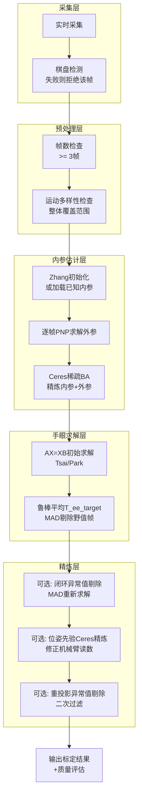

## 1. 引言

手眼标定（Hand-Eye Calibration）是机器人视觉中的核心问题。它的目标是确定相机坐标系与机械臂坐标系之间的空间变换关系，使得相机感知到的物体坐标能够准确转换到机械臂基座坐标系，从而实现精确的抓取和操作。

我将介绍我在最近的双臂机器人工程中实现的一个**生产级手眼标定系统**，该系统同时支持**眼在手上（Eye-in-Hand）**和**眼在手外（Eye-to-Hand）**两种经典配置，并引入了多项鲁棒性优化技术。

## 2. 手眼标定问题回顾

### 2.1 两种配置

| 配置 | 相机位置 | 求解目标 | 适用场景 |
|------|---------|---------|---------|
| **Eye-in-Hand** | 相机固定在机械臂末端 | $T_{end}^{camera}$（末端到相机变换） | 随臂运动，灵活抓取 |
| **Eye-to-Hand** | 相机固定在外部 | $T_{base}^{camera}$（基座到相机变换） | 全局观察，视野稳定 |

### 2.2 数学推导：从闭环关系到 AX=XB

无论是哪种配置，都可以通过坐标变换的闭环关系推导出著名的 **AX = XB** 问题形式。

#### 对于 Eye-in-hand：

标定板固定在世界中，机械臂带动相机移动到多个位姿。对于任意两帧 i 和 j，闭环关系为：

$$
T_{base}^{object} = T_{base}^{end_i} \cdot T_{end}^{camera} \cdot T_{camera_i}^{object}
$$

$$
T_{base}^{object} = T_{base}^{end_j} \cdot T_{end}^{camera} \cdot T_{camera_j}^{object}
$$

联立得：

$$
(T_{base}^{end_j})^{-1} \cdot T_{base}^{end_i} \cdot T_{end}^{camera} = T_{end}^{camera} \cdot T_{camera_i}^{object} \cdot (T_{camera_j}^{object})^{-1}
$$

令：

$$
A = (T_{base}^{end_j})^{-1} \cdot T_{base}^{end_i}
$$
$$
B = T_{camera_i}^{object} \cdot (T_{camera_j}^{object})^{-1}
$$
$$
X = T_{end}^{camera}
$$

得到：
$$
AX = XB
$$

#### 对于 Eye-to-hand：

标定板固定在机械臂末端，相机固定在外部。类似推导可得相同形式的 AX=XB，只是 X 的含义不同：

$$
X = T_{base}^{camera}
$$

## 3. 系统架构设计

我们的标定系统采用模块化设计，整体架构如下：

```
depth_chessboard_calib/
├── include/depth_chessboard_calib/
│   ├── calibrators/
│   │   ├── eye_in_hand_calibrator.hpp     # Eye-in-hand 标定器
│   │   ├── joint_handeye_calibrator.hpp   # Eye-to-hand 联合标定器
│   │   ├── calibration_validator.hpp      # 标定结果验证器
│   │   └── types.hpp                       # 数据类型定义
│   └── algorithms/
│       └── handeye_solver.hpp             # 手眼求解器
└── src/
    ├── calibrators/
    ├── algorithms/handeye_solver.cpp       # 核心求解算法
    └── ros2/calibration_server.cpp        # ROS2 服务端
```

### 3.1 多层过滤与标定流水线

整个系统采用**多层过滤**的设计思想，每层过滤解决不同粒度的问题，避免"一刀切"的粗暴拒绝：



各层过滤的职责总结：

| 过滤层级 | 过滤对象 | 触发时机 | 过滤方式 | 说明 |
|---------|---------|---------|---------|------|
| **① 棋盘检测过滤** | 单帧 | 实时采集时 | 逐帧拒绝 | 这一帧棋盘没检测到，直接拒绝，不影响已存的帧 |
| **② 运动多样性检查** | 整组数据 | 标定开始前 | 整组拒绝 | 检查整体覆盖范围，防止 AX=XB 病态 |
| **③ 鲁棒平均异常值剔除** | 个别帧 | 反推 T_ee_target 时 | 自动剔除野值帧 | 基于平移 MAD，只影响平均过程 |
| **④ 闭环异常值剔除** | 个别帧 | AX=XB 初解后 | 逐帧剔除，重新求解 | 基于闭环残差 MAD，多次标定后自动淘汰坏帧 |
| **⑤ 重投影异常值剔除** | 个别帧 | 最终解后 | 逐帧剔除，重新求解 | 基于重投影误差 MAD，二次过滤 |

## 4. 关键技术点解析

### 4.1 运动多样性预检查

**问题**：如果机械臂在采集数据时运动范围太小，AX=XB 问题会变成病态（ill-posed），解出来的结果不可靠。这个检查是**对整个数据集的一次性前置检查**，不是逐帧判断。

**源码实现**：

```cpp
// 对任意两两组合，取最大平移差和最大旋转差
for (lhs = 0..N; rhs = lhs+1..N):
    max_trans_delta = max(||T_lhs.trans - T_rhs.trans||)   // 最远的两帧相距多远
    max_rot_delta  = max(angle(R_lhs, R_rhs))              // 最远的两帧转了多少度

// 当且仅当 平移和旋转都小于阈值，才拒绝
if (max_trans_delta < min_t && max_rot_delta < min_r):
    return "标定失败: 机器人位姿变化不足"
```

**关键点**：
- 计算的是**所有帧对之间的最大距离**，不是每个轴的最小跨度
- 判断条件是 `&&`（且），不是 `||`（或）—— 平移和旋转**都小于阈值**才拒绝
- 也就是说，只要平移变化足够大 **或** 旋转变化足够大，检查就通过
- 这是**整体数据集的准入检查**，不是逐帧评价

**对此你可能会有疑问："那对于已经采集好的数据，不会自动剔除不好的姿态吗？"**

答案是：**它确实不会在这步剔除个别帧，因为这不是它的职责。** 个别帧的过滤由其他层级完成（见 3.1 节表格中的 ③④⑤）。运动多样性检查只回答一个问题："这套数据整体有没有足够的运动覆盖？" 如果覆盖不够，标定结果必然不可靠，所以直接拒绝是最合理的做法。

### 4.2 联合标定：内参与外参同时估计

很多人误以为"联合标定"是同时优化内参和手眼矩阵，实际上不是：

| 步骤 | 优化对象 | 说明 |
|------|---------|------|
| 1 | 内参 + 所有帧外参 | Ceres 稀疏BA |
| 2 | 手眼矩阵 | 固定内参外参，单独 AX=XB 求解 |

**联合标定 vs 固定内参**：

| 模式 | 使用场景 | 计算量 |
|------|---------|--------|
| 固定内参 | 已经通过标定板得到内参 | 快 |
| 联合标定 | 不知道相机内参，从零开始 | 较慢，但精度相当 |

我们使用 Ceres 做 BA 而非 OpenCV 的 `calibrateCamera`：

- **优点**：稀疏 BA 只优化内参和外参，在多帧下比 OpenCV 的稠密优化更快
- **鲁棒性**：使用 Huber 损失函数，对异常点更鲁棒

### 4.3 Tsai vs Park：两种经典解法对比

OpenCV 提供了多种 AX=XB 解法，我们项目中结合使用：

| 对比维度 | Tsai (1989) | Park (1994) |
|---------|-------------|-------------|
| 求解顺序 | 先旋转，后平移（两步线性） | 旋转平移同时最小化 |
| 方法性质 | 闭式解，不迭代 | 最小二乘，迭代求解 |
| 噪声敏感性 | 较高 | 较低 |
| 精度 | 一般 | 通常更高 |

**我们的策略**：
```cpp
// 优先尝试 Park，如果失败（产生NaN），回退到 Tsai
try {
    cv::calibrateHandEye(..., cv::CALIB_HAND_EYE_PARK);
} catch (...) {
    cv::calibrateHandEye(..., cv::CALIB_HAND_EYE_TSAI);
}
```

### 4.4 位姿先验精炼：为什么需要，理论依据是什么？

**问题背景**：
- 机械臂编码器读数有误差
- TCP 标定本身也有误差
- 这些误差会传递到 `T_base_end`，进而影响 AX=XB 的解

**核心思想**：
- 不把 `T_base_end` 当作常量，而是当作优化变量
- 添加马氏先验：`(T_optimized - T_measured)^2 * weight`
- 允许优化器小幅修正机械臂位姿，但不允许偏离太远
- 同时联合优化手眼矩阵，减小闭环残差

**Ceres 误差项设计**：

```cpp
// 标准手眼约束：T_base_cam * T_cam_target = T_base_ee * T_ee_target
// 残差由旋转部分（四元数）和平移部分组成
template <int>
bool HandEyePoseError::operator()(...) const {
    // 计算左右两边变换
    Eigen::Quaterniond q_lhs = q_base_cam * q_cam_target;
    Eigen::Quaterniond q_rhs = q_base_ee * q_ee_target;
    Eigen::Quaterniond q_err = q_rhs * q_lhs.inverse();

    // 残差：[旋转误差(3), 平移误差(3)]
    residual[0-2] = 2 * Eigen::Vector3d(q_err.x(), q_err.y(), q_err.z());
    residual[3-5] = t_lhs - t_rhs;
    return true;
}
```

**为什么可选**：
- 如果机械臂精度已经很高，TCP 标定准确，这一步增益有限
- 开启会增加计算时间
- 但对于高精度应用，建议开启

### 4.5 闭环异常值剔除：MAD 方法

在 AX=XB 求解出初值后，系统会做第一次异常值剔除，基于**闭环残差**（手眼链的几何一致性）：

```cpp
// 1. 计算每帧的闭环残差
for each frame i:
    error[i] = ||T_base_cam * T_cam_target_i - T_base_ee_i * T_ee_target||

// 2. MAD 计算
med = median(error)
mad = median(|error_i - med|)

// 3. 剔除阈值
threshold = med + 3.0 * mad

// 4. 按误差降序排序，优先剔除残差最大的帧
//    保留至少 3 帧，最多剔除 30%
```

**为什么这是必要的**：
- 运动多样性检查只保证整体覆盖范围，不保证个别帧的质量
- 个别帧可能因为抖动、棋盘检测偏差等原因，导致 PnP 求解出的外参与其他帧不一致
- 这些坏帧会严重拉低 AX=XB 的解，必须剔除后重新求解

**为什么在这里做而不是在采集时做**：
- 采集时只知道棋盘检测是否成功，不知道手眼链是否一致
- 只有解出 AX=XB 的初值后，才能通过闭环残差判断哪些帧是坏的

### 4.6 重投影异常值剔除：二次过滤

在闭环异常值剔除和位姿先验精炼之后，系统还会做第二次过滤，基于**重投影误差**：

```
1. 用最终标定结果逐帧计算重投影误差
2. median_err = 中位数(error)
3. mad = 中位数(|error_i - median_err|)
4. 剔除阈值：error_i > median_err + threshold * mad
5. 保留至少 3 帧，最多剔除 max_reject_fraction（默认30%）
```

**与闭环异常值剔除的区别**：

| 过滤方式 | 评价指标 | 作用 |
|---------|---------|------|
| 闭环异常值剔除 | 手眼链闭环残差 | 检查手眼链几何一致性 |
| 重投影异常值剔除 | 像素重投影误差 | 检查图像投影精度 |

两者互补，一个检查的是 3D 几何一致性，一个检查的是 2D 像素精度。

## 5. 实际标定教程

### 5.1 环境准备

项目基于 ROS2 Humble 开发，需要以下依赖：

```xml
<depend>rclcpp</depend>
<depend>sensor_msgs</depend>
<depend>cv_bridge</depend>
<depend>image_transport</depend>
<depend>ceres-solver</depend>
<depend>OpenCV</depend>
<depend>Eigen3</depend>
```

编译：

```bash
cd ~/colcon_ws
colcon build --packages-select depth_chessboard_calib
source install/setup.bash
```

### 5.2 数据采集准备

#### 对于 Eye-in-hand（眼在手上）：

1. **打印棋盘格**，固定在平稳的桌面上（相对于基座固定）
   - 测量实际方格边长，填入配置
   - 记录内角点数（例如 9x6）

2. **采集要求**：
   - 机械臂带动相机移动到不同位姿
   - 保证棋盘充满视野，且姿态变化大（平移+旋转都要有）
   - 采集 10~20 帧足够
   - 每帧保存：
     - 图像（放到 `data_dir/images/`）
     - 当前 `T_base_end`（保存到 `data_dir/poses/`，每个位姿一个文件）

#### 对于 Eye-to-hand（眼在手外）：

1. **把棋盘格固定在机械臂末端**
2. **相机固定不动**
3. 机械臂带动棋盘到不同位姿，采集要求同上

### 5.3 配置文件

创建 `config/calibration.yaml`：

```yaml
calibration:
  eye_hand_mode: "eye_in_hand"  # 或 "eye_to_hand"
  square_size_m: 0.025          # 棋盘方格边长，单位米
  inner_corners_cols: 9
  inner_corners_rows: 6
  max_calibration_frames: 20
  reproj_error_threshold_px: 1.0
  fix_intrinsics: false         # false=联合标定内参，true=使用已有内参
  min_motion_diversity_translation_m: 0.02
  min_motion_diversity_rotation_deg: 5.0
  outlier_rejection_enabled: true
  outlier_rejection_mad_factor: 2.5
  outlier_rejection_max_reject_fraction: 0.3
  pose_refinement_enabled: true
  pose_refinement_max_translation_m: 0.005
  pose_refinement_max_rotation_deg: 4.0
```

### 5.4 启动标定服务

```bash
ros2 launch depth_chessboard_calib calibration.launch.py \
    config_file:=/path/to/your/config.yaml
```

### 5.5 调用标定服务

```bash
ros2 service call /calibrate_handeye \
    depth_chessboard_calib/srv/CalibrateHandEye \
    "{data_dir: '/path/to/your/data', \
      profile_name: 'my_robot_calib', \
      calibration_frame: 'camera_color_optical_frame', \
      calibration_to_output_child: 'camera_link'}"
```

### 5.6 结果解读

标定成功后，会在输出目录保存：

```
output/
├── camera_intrinsics.yaml      # 相机内参
├── handeye_pose.yaml           # 手眼变换矩阵
└── calibration_report.txt      # 质量报告
```

报告中会给出：

- 重投影误差 RMS
- 闭环残差 RMS
- 最终使用帧数（可能比采集帧数少，因为异常值被剔除了）

一般来说：
- 重投影误差 < 0.5 px 优秀
- 重投影误差 < 1.0 px 可用
- 重投影误差 > 1.5 px 建议重新采集

## 6. 常见问题排查

### Q1: 标定失败，提示"机器人位姿变化不足"

**原因**：所有帧之间的最大平移跨度和最大旋转跨度都太小，AX=XB 问题病态。

**解决**：重新采集，让机械臂移动幅度更大一些。注意：只要平移变化足够大 **或** 旋转变化足够大，检查就能通过，不必两个维度都满足。

### Q2: 位姿先验精炼失败，提示"优化后波动过大"

**原因**：原始数据几何一致性太差，即使允许修正到最大幅度，残差仍然很大。

**解决**：检查数据采集是否正确，棋盘检测是否正常。建议重新采集。

### Q3: 重投影误差很大，但看起来每帧棋盘都检测到了

**原因**：可能有个别帧被误检测（角点顺序错了），或者标定板尺寸测量不准。

**解决**：
1. 确保 `outlier_rejection_enabled: true`（默认开启），系统会自动剔除坏帧
2. 检查 `square_size_m` 是否与实际一致

### Q4: 采集时某一帧棋盘没检测到，数据就废了吗？

**不会**。`addObservation` 只会拒绝当前这一帧，之前已经存好的帧完全不受影响，继续采集下一帧即可。

## 7. 质量验证

标定完成后，建议用验证集评估精度：

1. 预留 3~5 帧不参与标定，作为验证集
2. 用标定好的内参和手眼矩阵，计算验证集的重投影误差和闭环残差
3. 如果验证集误差和标定集误差接近，说明标定结果泛化性好

我们系统内置了 `CalibrationValidator` 可以直接输出误差统计。

## 8. 总结

本文介绍了一种鲁棒手眼标定系统。核心特点：

✅ **双模式支持**：同时支持 Eye-in-Hand 和 Eye-to-Hand  
✅ **多层过滤体系**：采集层逐帧过滤 → 预处理层整体准入 → 求解层自动剔除异常帧，各层各司其职  
✅ **多阶段优化**：Zhang 初始化 → PnP → Ceres BA → AX=XB → Ceres SE(3) 精炼  
✅ **双重异常值剔除**：闭环残差 MAD + 重投影误差 MAD，分别从几何一致性和投影精度两个维度过滤坏帧  
✅ **质量保证**：闭环残差检查 + 重投影误差门禁 + 独立验证集支持  
✅ **生产就绪**：YAML 持久化 + 自动 TF 发布 + profile 版本管理
